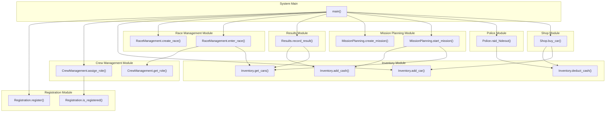

# Integration Testing Report

## 2.1 Call Graph

The call graph below shows all function calls within and between modules. Use this as a reference for the hand-drawn diagram.

## Additional Modules

1. **Police Module**: Simulates police raids on the crew hideout. When heat exceeds a threshold, half the crew's cash is seized. Interacts with the Inventory module to deduct cash.
2. **Shop Module**: Lets crew members purchase cars using their cash. Interacts with Inventory to check if the crew can afford the purchase and to add the car.

## 2.2 Integration Test Cases

### Test 1: Registering a driver and entering a race
- **Modules involved**: Registration, Crew Management, Race Management, Inventory
- **Scenario**: Register "Dom", assign him the "driver" role, add a car, then attempt to enter a race.
- **Expected result**: `enter_race()` returns True since all conditions are met (registered driver + car available).
- **Actual result**: Passed.
- **Why needed**: This checks the most basic multi-module workflow — registration feeds into crew roles which gates race entry, and inventory must have a car.

### Test 2: Entering a race without a registered driver
- **Modules involved**: Race Management, Crew Management
- **Scenario**: Try to enter "Brian" (never registered) into a race.
- **Expected result**: Raises `ValueError` because Brian has no driver role.
- **Actual result**: Passed.
- **Why needed**: Ensures the system actually rejects unregistered people rather than silently allowing entry.

### Test 3: Race completion updates inventory
- **Modules involved**: Results, Inventory
- **Scenario**: Record a race result with a $5000 prize. A car is already in inventory.
- **Expected result**: Cash goes up by 5000, car condition drops to 90 (damage from racing).
- **Actual result**: Passed.
- **Why needed**: Verifies that race outcomes correctly flow into the inventory — both the prize money and the car wear.

### Test 4: Mission assignment checks for correct roles
- **Modules involved**: Mission Planning, Crew Management, Registration
- **Scenario**: Try to start a "strategist" mission with no strategist registered, then register one and try again.
- **Expected result**: First call raises `ValueError`, second call succeeds and pays out the reward.
- **Actual result**: Passed.
- **Why needed**: Missions require specific roles. This checks that the system correctly looks up crew roles before allowing a mission to start.

### Test 5: Mechanic mission triggers car repairs
- **Modules involved**: Mission Planning, Crew Management, Inventory
- **Scenario**: Add a car with condition=50, register a mechanic, then start a mechanic mission.
- **Expected result**: All cars in inventory get their condition restored to 100.
- **Actual result**: Passed.
- **Why needed**: The mechanic role has a special side-effect — it repairs all cars. This checks that the mission module correctly modifies inventory state.

### Test 6: Police and Shop modules interact with Inventory
- **Modules involved**: Shop, Police, Inventory
- **Scenario**: Start with $50k cash. Buy a car for $40k via Shop. Then trigger a police raid at heat=100.
- **Expected result**: After buying the car, cash = $10k. After the raid (heat > 50), police seize half ($5k), leaving $5k.
- **Actual result**: Passed.
- **Why needed**: Tests that both custom modules correctly read and modify the shared inventory state in sequence.

### Test 7: Full system end-to-end workflow
- **Modules involved**: All 8 modules
- **Scenario**: Full lifecycle — register two crew members (driver + mechanic), buy a car, enter a race, record a win, get raided by police, then run a mechanic mission to repair the car.
- **Expected result**: Cash and car condition update correctly at each step across all module boundaries.
- **Actual result**: Passed.
- **Why needed**: Tests that all modules work together in a realistic sequence without any state getting lost or corrupted between steps.

### Test 8: Edge cases and negative branches
- **Modules involved**: All modules
- **Scenario**: Tests various invalid operations across the system:
  1. Registering the same person twice (should return False)
  2. Assigning a role to an unregistered person (should raise ValueError)
  3. Entering a race without any cars in inventory (should raise ValueError)
  4. Recording results with empty car inventory (should not crash)
  5. Police raid with low heat (should confiscate nothing)
  6. Shop purchase without enough cash (should raise ValueError)
  7. Inventory cash deduction when balance is too low (should return False)
- **Expected result**: Each invalid operation is handled gracefully — either returning False or raising an appropriate error.
- **Actual result**: Passed.
- **Why needed**: Makes sure the system handles bad inputs and edge cases without crashing or allowing invalid state.
